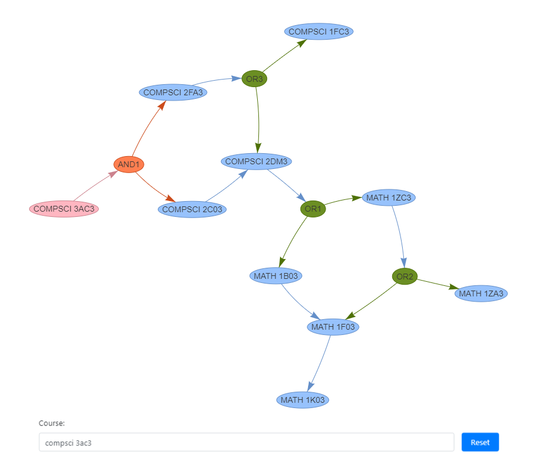

# McMaster University Course Dependency Graph

https://zhanggq96.github.io/CourseDependencyGraph/

## About: 

Models pre-requisite dependencies between courses. Data is from [AcademicCalendars](https://academiccalendars.romcmaster.ca/preview_course_nopop.php?catoid=32&coid=177311). The text from the "Prerequisite(s)" section is parsed into a tree modelling the logical dependencies between courses (I am not aware of any other source of data). On the browser end, these trees are then recursively merged into a graph to visualize the full dependence structure, starting from the very first courses required.

I have tried to remove the redundant branches of the graph, but did not get around to handling logical redundancies (e.g. converting AND[A, AND[B, C]] into AND[A, B, C]). Moreover, for some courses, the prerequisite graph is *incorrect* or missing altogether, mainly because of the inconsistent use of language in AcademicCalendars. Unfortunately, it takes a disproportionate amount of effort to handle these well-hidden edge cases, but it should work well for most courses.

## Example usage:

 
